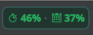
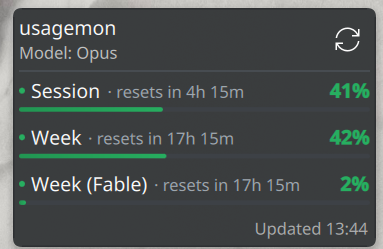
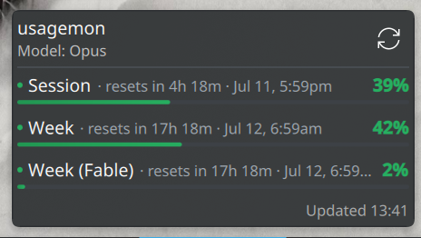

# usagemon

A KDE Plasma 6 panel widget that shows your [Claude Code](https://claude.com/claude-code)
subscription usage — session and weekly rate limits — at a glance, so you don't
have to type `/usage` in a terminal every time.

It reads your usage in the background and shows a compact, color-coded readout
in your panel. Click it for a popup with the full breakdown and reset times.

<p align="center">
  
</p>

<p align="center">
  
  &nbsp;&nbsp;
  
</p>

## Features

- **Panel readout**: session and week usage side by side (e.g. `29% · 36%`),
  each preceded by its own Breeze icon — a stopwatch for the session limit and
  a week-calendar for the weekly limit.
- **Severity colors**: the percentages and icons turn from green → yellow → red.
  When the OAuth API is used, this follows the API's own `severity` for each
  limit; otherwise it falls back to configurable warning/critical thresholds.
- **Detail popup**: per-limit progress bars (session, week, plus any extra limits
  such as a per-model weekly limit) with a live reset countdown
  (e.g. `resets in 2h 14m`). Enable **Wider layout** to also show the absolute
  time (`resets in 2h 14m · Jul 11, 5:59pm`).
- **Notifications**: optional desktop notification when a limit crosses a
  configurable threshold (default 90%).
- **Active model**: reads your configured model from `~/.claude/settings.json`
  and shows it in the popup header and tooltip.
- **Auto refresh** on a configurable interval, plus manual refresh
  (middle-click the panel item, the popup's refresh button, or the context menu).

## Requirements

- KDE Plasma 6
- [Claude Code](https://claude.com/claude-code) installed and logged in. usagemon
  reuses that existing login — you don't authenticate separately.

## Install

```sh
git clone https://github.com/Script-hpp/usagemon.git
cd usagemon
./install.sh
```

Then right-click your panel → **Add Widgets…** → search for **usagemon** and
add it.

## Uninstall

```sh
./uninstall.sh
```

## Configuration

Right-click the widget → **Configure usagemon…** → **General**:

| Option | Default | Description |
| --- | --- | --- |
| Data source | Automatic | `Automatic` (OAuth API, then CLI), `OAuth API only`, or `CLI only` |
| Claude command | `claude` | Path/name of the `claude` binary (used by the CLI source) |
| Poll interval (seconds) | `120` | How often to refresh (min 60 — the source is rate-limited) |
| Warn threshold (%) | `75` | Usage at which the readout turns yellow (when no API severity) |
| Critical threshold (%) | `90` | Usage at which the readout turns red (when no API severity) |
| Notifications | on | Notify when a limit is high |
| Notify threshold (%) | `90` | Usage at which a notification fires |
| Wider layout | off | Widen the popup and add the absolute reset time next to the countdown |

## How it works

There is no public Anthropic API for Claude Code's subscription rate limits
(session %, week %). usagemon gets them the same way the CLI itself does, with a
two-tier, **privacy-first** approach:

1. **OAuth API (primary).** A small bundled script
   ([`fetch-usage.sh`](package/contents/ui/fetch-usage.sh)) reads the OAuth
   access token from Claude Code's own credentials file and calls
   `GET https://api.anthropic.com/api/oauth/usage` — the exact endpoint the
   `claude` CLI uses internally. The JSON response is parsed in
   [`UsageApi.js`](package/contents/ui/UsageApi.js).
2. **CLI (fallback).** If the API is unavailable (no token, offline, rate
   limited), it falls back to running `claude -p "/usage"` and parsing the text
   output ([`UsageParser.js`](package/contents/ui/UsageParser.js)).

You choose the mode in the settings (Automatic / API only / CLI only).

### Privacy

- usagemon **reuses your existing local Claude Code login** — no separate
  sign-in, no passwords.
- The OAuth token is read locally and **only ever sent to `api.anthropic.com`**
  (the same host the CLI talks to). It is never stored, copied elsewhere, or
  logged — the token stays inside the fetch subprocess and never enters the
  widget code.
- No third-party servers are involved.

### A note on refresh rate

The usage endpoint is rate-limited (both the API and the CLI hit the same one),
so polling faster than ~1/minute just yields errors — and the numbers (a 5-hour
session window and a 7-day week window) change slowly anyway. The default is
every 2 minutes; the minimum is 60 seconds.

## Publishing / installing from the KDE Store

Plasma widgets can be shared on the [KDE Store](https://store.kde.org) so anyone
can install them from **Add Widgets… → Get New Widgets… → Download New Plasma
Widgets** (the "Get Hot New Stuff" flow).

Build the uploadable archive with:

```sh
./build-plasmoid.sh    # produces usagemon-<version>.plasmoid
```

Then upload that `.plasmoid` file at <https://store.kde.org> under
**Plasma 6 → Plasma Widgets** (requires a free opendesktop.org account). Once
published, users can also install it directly:

```sh
kpackagetool6 --type Plasma/Applet --install usagemon-<version>.plasmoid
```

## License

MIT — see [LICENSE](LICENSE).
