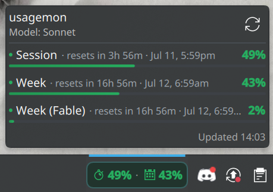
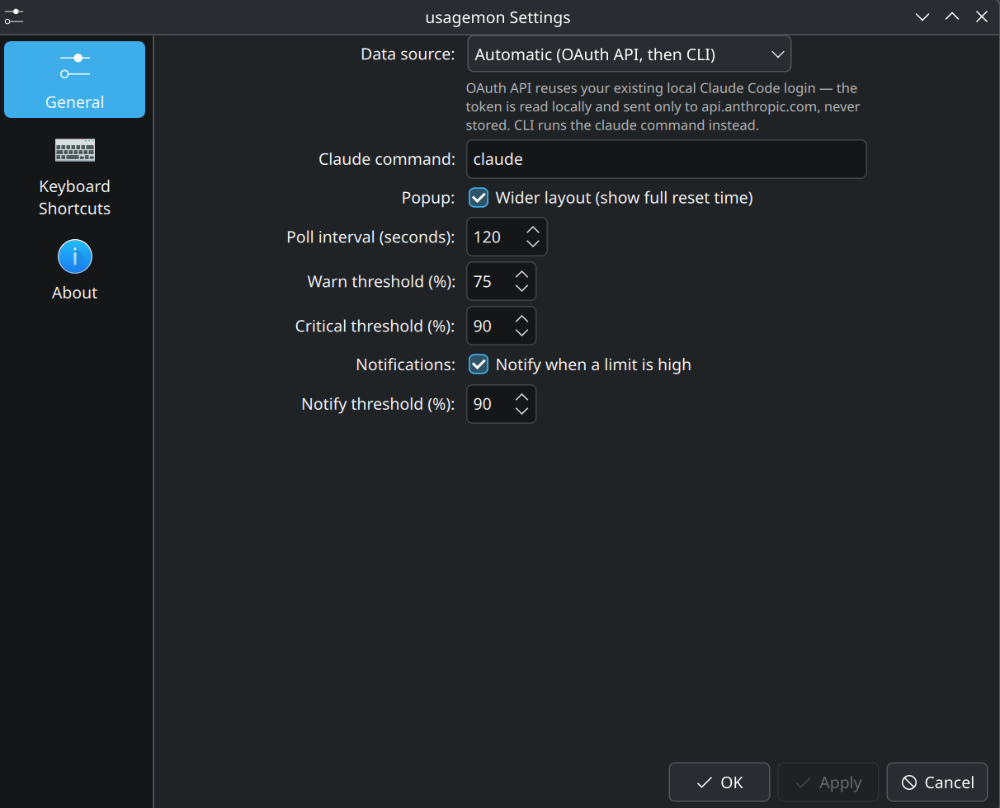

# usagemon

[](https://store.kde.org/p/2365234/)

A KDE Plasma 6 panel widget that shows your [Claude Code](https://claude.com/claude-code)
**or** [Cline](https://cline.bot) subscription usage — session and weekly rate
limits — at a glance, so you don't have to type `/usage` in a terminal every time.

It reads your usage in the background and shows a compact, color-coded readout
in your panel. Click it for a popup with the full breakdown and reset times.
Pick which agent to monitor in the widget's settings.

<p align="center">
  
</p>

<p align="center">
  
  &nbsp;&nbsp;
  
</p>

<details>
<summary>Settings dialog</summary>
<p align="center">
  
</p>
</details>

## Features

- **Panel readout**: session and week usage side by side (e.g. `29% · 36%`),
  each preceded by its own Breeze icon — a stopwatch for the session limit and
  a week-calendar for the weekly limit.
- **Severity colors**: the percentages and icons turn from green → yellow → red.
  When the OAuth API is used, this follows the API's own `severity` for each
  limit; otherwise it falls back to configurable warning/critical thresholds.
- **Detail popup**: per-limit progress bars (session, week, plus any extra limits
  such as a per-model weekly limit) with a live reset countdown
  (e.g. `resets in 2h 14m`). Enable **Wider layout** to also show the absolute
  time (`resets in 2h 14m · Jul 11, 5:59pm`).
- **Notifications**: optional desktop notification when a limit crosses a
  configurable threshold (default 90%).
- **Active model**: reads your configured model from `~/.claude/settings.json`
  and shows it in the popup header and tooltip.
- **Auto refresh** on a configurable interval, plus manual refresh
  (middle-click the panel item, the popup's refresh button, or the context menu).

## Requirements

- KDE Plasma 6
- [Claude Code](https://claude.com/claude-code) **and/or** [Cline](https://cline.bot)
  installed and logged in. usagemon reuses that existing login — you don't
  authenticate separately. Choose which one to monitor in the widget settings.

## Install

**Option A — from the KDE Store (easiest):** right-click your panel →
**Add Widgets…** → **Get New Widgets…** → search for **usagemon** (or install
it directly from [store.kde.org](https://store.kde.org/p/2365234/)).

**Option B — from source:**

```sh
git clone https://github.com/Script-hpp/usagemon.git
cd usagemon
./install.sh
```

Then right-click your panel → **Add Widgets…** → search for **usagemon** and
add it.

## Uninstall

```sh
./uninstall.sh
```

## Configuration

Right-click the widget → **Configure usagemon…** → **General**:

| Option | Default | Description |
| --- | --- | --- |
| Agent / Service | `Claude Code` | Which agent's usage to monitor: `Claude Code` or `Cline` |
| Data source | Automatic | `Automatic` (OAuth API, then CLI), `OAuth API only`, or `CLI only` *(Claude Code only — Cline is API-only)* |
| Claude command | `claude` | Path/name of the `claude` binary (used by the CLI source) |
| Poll interval (seconds) | `120` | How often to refresh (min 60 — the source is rate-limited) |
| Warn threshold (%) | `75` | Usage at which the readout turns yellow (when no API severity) |
| Critical threshold (%) | `90` | Usage at which the readout turns red (when no API severity) |
| Notifications | on | Notify when a limit is high |
| Notify threshold (%) | `90` | Usage at which a notification fires |
| Wider layout | off | Widen the popup and add the absolute reset time next to the countdown |

## How it works

There is no public Anthropic API for Claude Code's subscription rate limits
(session %, week %). usagemon gets them the same way the CLI itself does, with a
two-tier, **privacy-first** approach:

1. **OAuth API (primary).** A small bundled script
   ([`fetch-usage.sh`](package/contents/ui/fetch-usage.sh)) reads the OAuth
   access token from Claude Code's own credentials file and calls
   `GET https://api.anthropic.com/api/oauth/usage` — the exact endpoint the
   `claude` CLI uses internally. The JSON response is parsed in
   [`UsageApi.js`](package/contents/ui/UsageApi.js).
2. **CLI (fallback).** If the API is unavailable (no token, offline, rate
   limited), it falls back to running `claude -p "/usage"` and parsing the text
   output ([`UsageParser.js`](package/contents/ui/UsageParser.js)).

You choose the mode in the settings (Automatic / API only / CLI only).

### Cline support

When **Agent / Service** is set to **Cline**, the widget switches to Cline's own
usage endpoint. There is no public Cline API for rate limits either, so usagemon
again reuses the existing local Cline login:

1. **Cline usage API (API-only).** A bundled script
   ([`fetch-cline-usage.sh`](package/contents/ui/fetch-cline-usage.sh)) reads the
   access token from `~/.cline/data/settings/providers.json` (the file Cline's CLI
   itself writes — `providers.<name>.settings.auth.accessToken`) and calls
   `GET https://api.cline.bot/api/v1/users/me/plan/usage-limits`. The JSON
   response (`data.limits[]` with `type` = `five_hour`/`weekly`/`monthly`,
   `percentUsed`, `resetsAt`) is parsed in
   [`ClineApi.js`](package/contents/ui/ClineApi.js) into the same shape the rest
   of the widget uses. Cline provides no `severity`, so colors fall back to the
   configured warning/critical thresholds; the `monthly` limit shows as an extra
   row in the popup.
2. **No CLI fallback.** Cline's CLI does not expose a `/usage` text command, so
   the Cline source is API-only. If the API is unavailable (no token, expired
   token, offline), the widget shows the last known values and retries.

**Privacy (safe auth token):** the access token is read locally and **only ever
sent to `api.cline.bot`**. It is never placed in a shell variable, never passed
on curl's command line (so it is not visible via `ps`), never printed, logged, or
copied elsewhere — it is written to a `chmod 600` temp file that is removed right
after the request, and the token never enters the widget code. No third-party
servers are involved.

### Privacy

- usagemon **reuses your existing local Claude Code login** — no separate
  sign-in, no passwords.
- The OAuth token is read locally and **only ever sent to `api.anthropic.com`**
  (the same host the CLI talks to). It is never stored, copied elsewhere, or
  logged — the token stays inside the fetch subprocess and never enters the
  widget code.
- No third-party servers are involved.

### A note on refresh rate

The usage endpoint is rate-limited (both the API and the CLI hit the same one),
so polling faster than ~1/minute just yields errors — and the numbers (a 5-hour
session window and a 7-day week window) change slowly anyway. The default is
every 2 minutes; the minimum is 60 seconds.

## KDE Store

usagemon is published on the KDE Store: **<https://store.kde.org/p/2365234/>**

You can install it straight from there via **Add Widgets… → Get New Widgets…**
in Plasma, or download the `.plasmoid` archive from that page and install it
manually:

```sh
kpackagetool6 --type Plasma/Applet --install usagemon-<version>.plasmoid
```

To build a new release archive yourself (e.g. after making changes):

```sh
./build-plasmoid.sh    # produces usagemon-<version>.plasmoid
```

## License

MIT — see [LICENSE](LICENSE).
